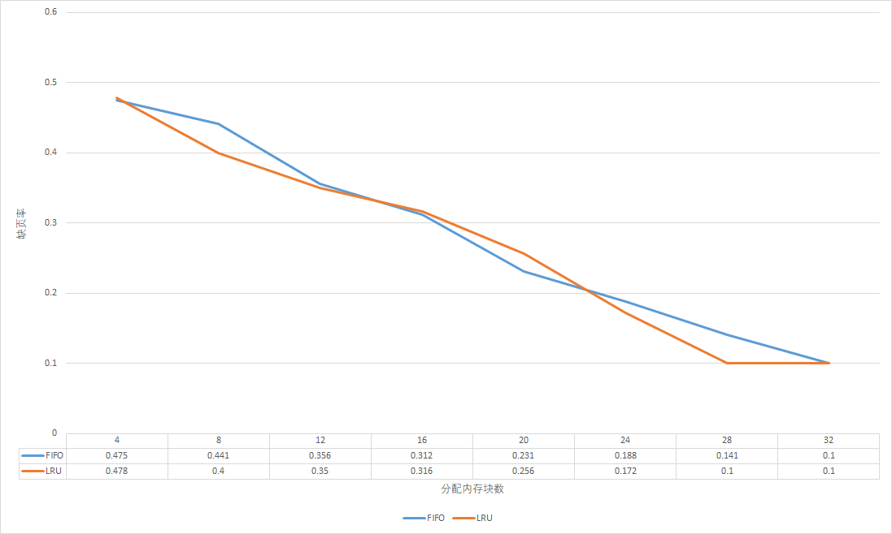
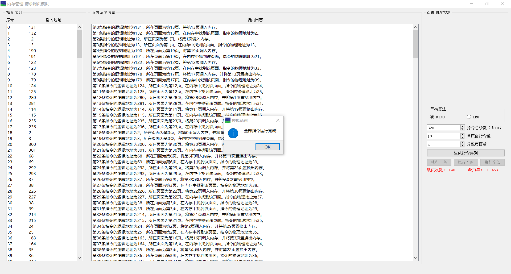

# 内存管理项目文档

> 项目选题：内存管理-请求分页分配方式

> 课程：操作系统

> 指导教师：王冬青

## 一、项目概述

本项目选题为内存管理-请求分页分配方式。

项目目的有三点，分别是了解页面、页表、地址转换，熟悉页面置换过程以及加深对请求调页系统的原理和实现过程的理解。

项目基本任务是运用请求调页存储管理方式模拟一个有320条指令的作业的执行过程，该作业的地址空间为 32 页，分配给该进程 4 个内存块，指令访问次序按一定规则随机生成。

## 二、需求分析

(1) 模拟程序指令对内存的访问。如果访问指令在内存中，则显示其物理地址，并转到下一条指令；如果没有在内存中，则发生缺页，此时需要记录缺页次数，并将其调入内存。

(2) 如果内存块已达分配数目，继续装入作业需要进行页面置换。页面置换方法可以使用 FIFO 或 LRU 算法。初始状态下内存中未装入页面。

(3) 指令访问次序按照 50% 的指令顺序执行，25% 均匀分布在前地址部分，25％ 均匀分布在后地址部分的原则来形成。

(4) 有基本的图形用户界面。

## 三、调页算法

### 1. FIFO 与 LRU 置换算法

FIFO 算法即先进先出置换算法。根据操作系统课本的描述，FIFO 算法是最简单的页置换算法。FIFO 页置换算法为每个页记录着该页调入内存的时间。当必须置换一页时，将选择最旧的页。不需要记录调入一页的确切时间。可以创建一个 FIFO 队列来管理内存中的所有页。队列中的首页将被置换。当需要调入页时，将它加到队列的尾部。

LRU 置换算法全称最近最少使用置换算法。LRU 置换为每个页关联其上次使用的时间。当必须置换一页时，LRU 选择最长时间没有使用的页。LRU 策略经常用于页置换算法，且被认为相当不错。

本程序使用列表 `MemoryAllocation` 来维护内存中已经调入的页。要添加页时总是添加到列表尾部，被置换掉的页则从列表头部移除。此时 FIFO 算法和 LRU 算法的实现十分方便，FIFO 算法就是前述方法，LRU 算法只需在前述方法的基础上每当一个页被访问时将其从列表中移除，并立即重新添加到列表尾部即可。

LRU 算法 和 FIFO 算法的缺页率如图所示：



可以看到 LRU 算法和 FIFO 算法的缺页率随分配页数的变化区别不大，且只为程序分配 4 个页面时都有约为 50% 的缺页率。这主要是由于本程序在模拟指令执行时使用的指令顺序随机生成算法在很大程度上忽略了程序的空间局部性及工作集合的性质。如果是应用于现实中的页面调度， LRU 算法的效果应当远好于 FIFO 算法。

### 2. 指令顺序生成算法

本模拟程序的指令顺序生成算法按照作业 PPT 上的描述设计。

首先，选定一个起始执行点 `start_point`，为了后续跳转前地址部分及后地址部分方便，这里的起始执行点不是完全随机选定，而是介于总指令数的 1/3 到 2/3 之间。起始执行点是第一条指令，起始执行点加 1 所在位置的指令是第二条指令。

然后，重复随机跳转到起始执行点的前地址部分和后地址部分，每次跳转后都往后依序再取一条指令。每轮这样的循环一共取 4 条指令，如此直至取出的指令数等于总指令数为止。具体代码如下所示：

```python
start_point = randint(self.TotalCommandValue//3, self.TotalCommandValue * 2//3)
pointer = 1
self.MyCommandList.append(start_point)
pointer += 1
if pointer <= self.TotalCommandValue:
    self.MyCommandList.append(start_point + 1)
    pointer += 1            
while True:
    if pointer > self.TotalCommandValue:
        break         
    temp = randint(0, start_point - 1)
    self.MyCommandList.append(temp)
    pointer += 1
    if pointer > self.TotalCommandValue:
        break
    self.MyCommandList.append(temp + 1)
    pointer += 1
    if pointer > self.TotalCommandValue:
        break            
    temp = randint(start_point + 1, self.TotalCommandValue - 2)
    self.MyCommandList.append(temp)
    pointer += 1
    if pointer > self.TotalCommandValue:
        break
    self.MyCommandList.append(temp + 1)
    pointer += 1
```


## 四、用户界面


如上图所示。每个按钮上的描述即是该按钮执行的功能。指令序列按随机生成的指令执行顺序从小到大排序，调页日志记录了已经执行的指令进行的调页。

在页面调度控制区域可以选择 FIFO 或 LRU 置换算法，并对指令总条数，单页面指令数和分配页面数进行设置。在指令全部执行完成时，会有弹窗提示模拟结束，用户可以继续进行新一轮模拟。如下图所示：



## 五、项目总结

项目亮点：

 - 用户界面简单易懂，说明清晰，操作方便，设计比较直观
 
 - 可以自行修改指令总条数，单页面指令数和分配页面数
 
 - 界面有正确的布局设定，改变窗口大小不会妨碍窗口中元素正确显示

项目展望：

 - 用户界面的配色可能需要调整，目前只有缺页数和缺页率用了非默认颜色
 
 - 随机生成指令顺序的方式不够真实，没有模拟出真实程序应有的工作集合

## 六、附加说明

### 项目开发环境

 - **Win10 64位**
 
 - **Notepad++**
 
### 使用框架

 - **PyQt5**
 
### 开发语言

 - **Python**
 
### 通过源代码构建可执行程序

首先，需要安装 **PyQt5** （如果手工更改所有 **.py** 文件中 **import** 的包，也可以使用 **PySide2** ）

```
pip install pyqt5

pip install pyqt5-tools
```

然后在项目目录下执行：

```
pyinstaller -F -w -i favicon.ico main.spec
```

即可在 **./dist** 目录下得到可执行程序。

目录下的 **.ui** 文件是通过 **Qt Designer** 以所见即所得的方式制作的。相应的 **.py** 文件可以由 **.ui** 文件生成。只需在项目目录下执行：

```
pyuic5 -o memory_management.py memory_management.ui
```