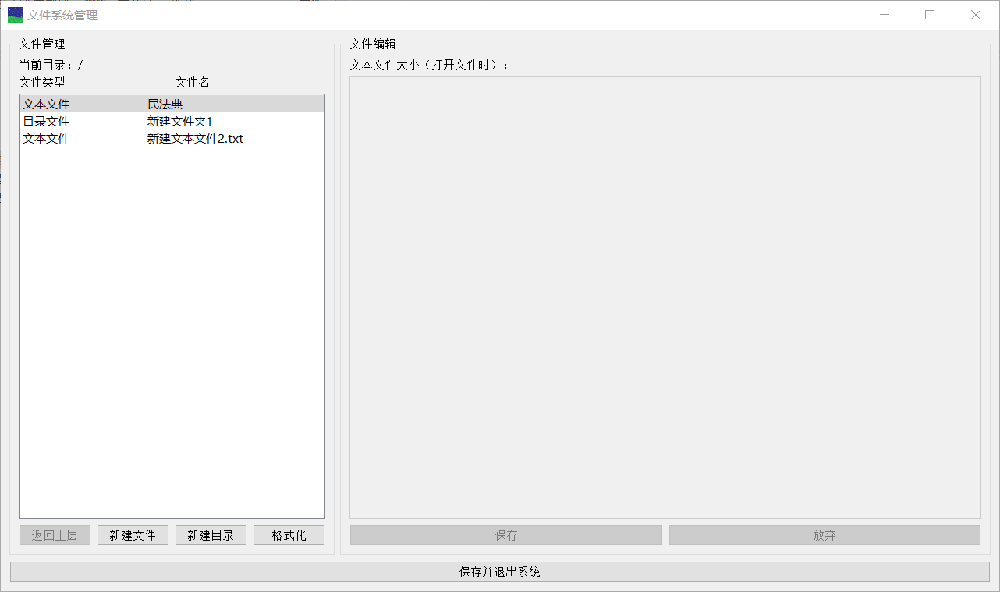
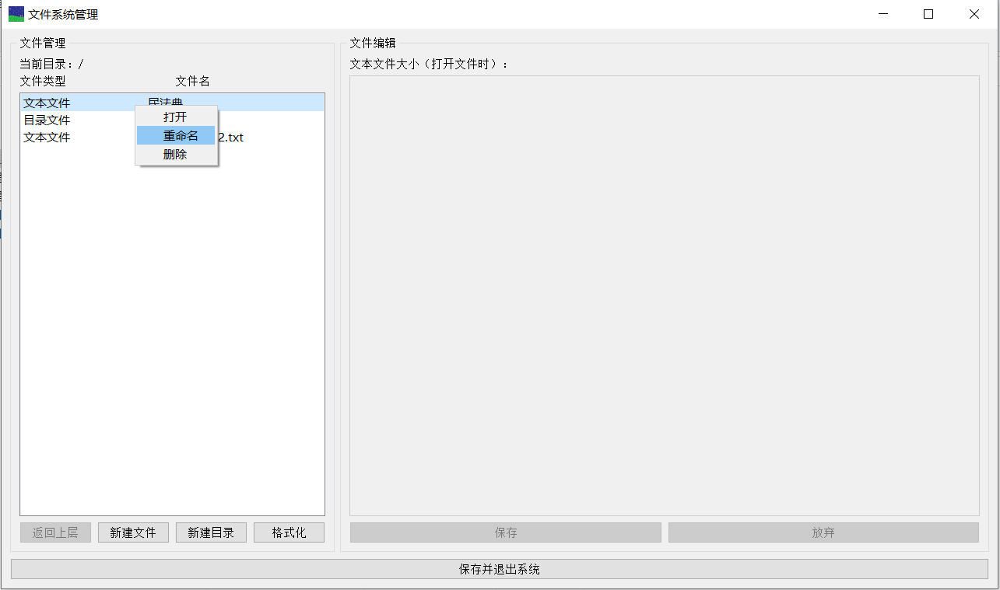
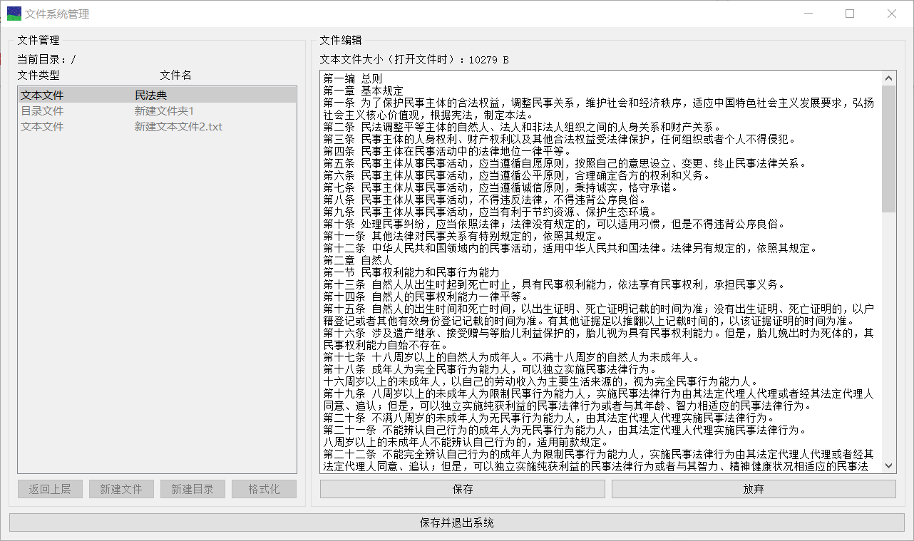

# 文件系统项目文档

> 项目选题：文件系统管理
>
> 课程：操作系统
>
> 指导教师：王冬青

## 一、项目概述

本项目选题为文件系统管理。

项目目的有四点，分别是：

 - 熟悉文件存储空间的管理
 
 - 熟悉文件的物理结构、目录结构和文件操作
 
 - 熟悉文件系统管理实现
 
 - 加深对文件系统内部功能和实现过程的理解

项目基本任务是在内存中开辟一个空间作为文件存储器，在其上实现一个简单的文件系统。退出这个文件系统时，需要该文件系统的内容保存到磁盘上，以便下次可以将其恢复到内存中来。

## 二、需求分析

(1) 文件存储空间管理可采取显式链接（如FAT）或者其他方法。

(2) 空闲空间管理可采用位图或者其他方法。如果采用了位图，可将位图和FAT表合二为一。

(3) 文件目录采用多级目录结构。至于是否采用索引节点结构，自选。目录项目中应包含：文件名、物理地址、长度等信息，也可增加一些其他信息。

(4) 能提供格式化、创建子目录、删除子目录、显示目录、更改当前目录、创建文件、打开文件、关闭文件、写文件、读文件、删除文件等操作

(5) 有基本的用户界面

## 三、文件系统管理方法

### 1.基本算法

| 文件存储空间管理 | 空闲空间管理 | 文件目录 |
| ------ | ------ | ------ |
| 链表式 | 位图法 | 多级目录结构 |

### 2. 对字节串（块）的管理

本程序会在内存中开辟 32 MB 的空间，按每 1 KB 一个字节串（块）存入列表，即列表中共有 32 \* 1024 = 32768 个字节串（块）。字节串（块）的初始分配如下：

| 序号 | 用途 |
| ------ | ------ |
| 0 \- 3 | 空闲空间位图，前 5 位置 1，其余置 0 |
| 4 | 根目录的起始块 |
| 5 \- 32767 | 空闲空间 |

管理内存块用到的方法如下：

| 方法名 | 描述 |
| ------ | ------ |
| locate(word) | 将两字节的地址转换为整型的序号 |
| AssignMemory() | 分配块，将位图中相应位置 1，返回该块的序号 |
| AddData(location, data, next) | 向序号为 location 的块中写入数据 data，块的最后两字节保存后继块的序号 next |
| EraseData(location) | 清除序号为 location 的块中的数据，将位图中相应位置 0 |

**Python** 中实现位操作可以使用 **ctypes** 模块，但本程序在此使用了字节串、二进制数、字符串间的转化，以 **AssignMemory()** 代码举例如下：

```python
# 分配块，这里倒来倒去只是为了将被分配出去的一块在位图中的对应位置1
def AssignMemory(self):
    location = 0
    for i in range(4):
        my_tmp_array = bytearray(self.InnerDataBase[i])
        for j in range(1024):
            if my_tmp_array[j] != 255:
                tmp_str_list = bin(my_tmp_array[j])[2:]
                while len(tmp_str_list) < 8:
                    tmp_str_list = '0' + tmp_str_list
                tmp_str_list = list(tmp_str_list)
                for k in range(8):
                    if tmp_str_list[k] == '0':
                        tmp_str_list[k] = '1'
                        location = i * 1024 * 8 + j * 8 + k
                        break
                my_tmp_array[j] = int("".join(tmp_str_list), 2)
                self.InnerDataBase[i] = bytes(my_tmp_array)
                return location
    QMessageBox. critical(self, '错误','没有空余空间！\n程序将自动退出，所有更改将被抛弃。') 
    QApplication.quit()
```

### 3. 对文件的读写

读写文件用到的方法如下：

| 方法名 | 描述 |
| ------ | ------ |
| ReadFile(start_location) | 读取初始块序号为 start_location 的文件 |
| CutToZeroFile(start_location) | 将初始块序号为 start_location 的文件截短，释放除初始块外的所有块 |
| WriteFile(start_location, packed_data) | 向序号为 start_location 的块写入数据 packed_data，如果数据有剩余，就分配后续块，直至写完全部数据 |

注意 `CutToZeroFile(start_location)` 并没有修改初始块中的数据，因为数据总是整块写入的，无需将初始块在此时置零。**packed_data** 通常要追加两字节的 `b'\xfe\xfe'` 作为文件结束符（EOF）。

### 4. 对目录文件的额外操作

目录文件需要额外打包和解包，方法如下：

| 方法名 | 描述 |
| ------ | ------ |
| PackDirectory(my_list) | 把目录从列表打包成字节串 |
| UnpackDirectory(packed_bytes) | 把目录从字节串还原成列表 |

目录对应的列表是 `[str_list, location_list, size_list, type_list]` 的格式，其中 **str_list** 是每个子文件的名称，**location_list** 是每个子文件的大小，**size_list** 是每个子文件的大小（目录的大小记为零），**type_list** 是每个子文件的类型（1 代表目录文件，0 代表文本文件）。打包时用 `b'\xff'` 分隔各列表。

`PackDirectory(my_list)` 的代码如下：

```python
def PackDirectory(self, my_list):
    packed_bytes = b''
    str_list, location_list, size_list, type_list = my_list
    for i in range(len(str_list)):
        packed_bytes += str_list[i].encode(encoding = 'utf-8') + b'\xff' + location_list[i].to_bytes(2, byteorder='big') + size_list[i].to_bytes(2, byteorder='big')  + \
        type_list[i].to_bytes(2, byteorder='big') + b'\xff'
    return packed_bytes
```

### 5. 其他操作

其他操作对应的方法列举如下：

| 方法名 | 描述 |
| ------ | ------ |
| NewFile() | 新建文本文件，在初始块中写入文件结束符 |
| NewDirectory() | 新建子目录 |
| Format() | 格式化，基本就是重做初始化字节串列表的过程 |
| renameFileAction() | 重命名文件/目录，这会更新当前目录 |
| deleteFileAction() | 删除文件，这会更新当前目录 |
| removeDirectory(node) | 删除目录，并递归删除所有子文件和目录 |
| ReturnToParent(node) | 返回上层目录，这会保存当前目录 |

新建子目录时将子目录对应的列表初始化为 `["Parent\n"], [self.CurrentDirectoryNode], [0], [1]]`，用以实现返回上层目录。

## 四、用户界面



如上图所示。每个按钮上的描述即是该按钮执行的功能。右键点击文件列表中的某一项可以执行打开、删除或重命名操作。



在打开一个文本文件后，可以在右侧的文本编辑框中对该文本文件进行编辑。点击“保存”会将修改写入内存中的字节串列表内，点击“保存并退出系统”可以将更改存入硬盘中的 `FileSystem.mimg` 文件。



## 五、项目总结

项目亮点：

 - 用户界面简单易懂，说明清晰，操作方便，设计比较直观
 
 - 能正确处理中文编码，对文本文件可以正常进行读、写、追加操作，文件有恰当的默认名称
 
 - 界面有正确的布局设定，改变窗口大小不会妨碍窗口中元素正确显示

项目展望：

 - 用户界面的配色可能需要调整，目前完全使用了默认样式
 
 - 在文本框里输入超长文本的支持有待增加，以及需要删去若干 `QInputDialog` 提示框上莫名其妙的问号按钮

## 六、附加说明

### 项目开发环境

 - **Win10 64位**
 
 - **Notepad++**
 
### 使用框架

 - **PyQt5**
 
### 开发语言

 - **Python**
 
### 通过源代码构建可执行程序

首先，需要安装 **PyQt5** （如果手工更改所有 **.py** 文件中 **import** 的包，也可以使用 **PySide2** ）

```
pip install pyqt5

pip install pyqt5-tools
```

然后在项目目录下执行：

```
pyinstaller -F -w -i favicon.ico main.spec
```

即可在 **./dist** 目录下得到可执行程序。

目录下的 **.ui** 文件是通过 **Qt Designer** 以所见即所得的方式制作的。相应的 **.py** 文件可以由 **.ui** 文件生成。只需在项目目录下执行：

```
pyuic5 -o FileSystem.py FileSystem.ui
```