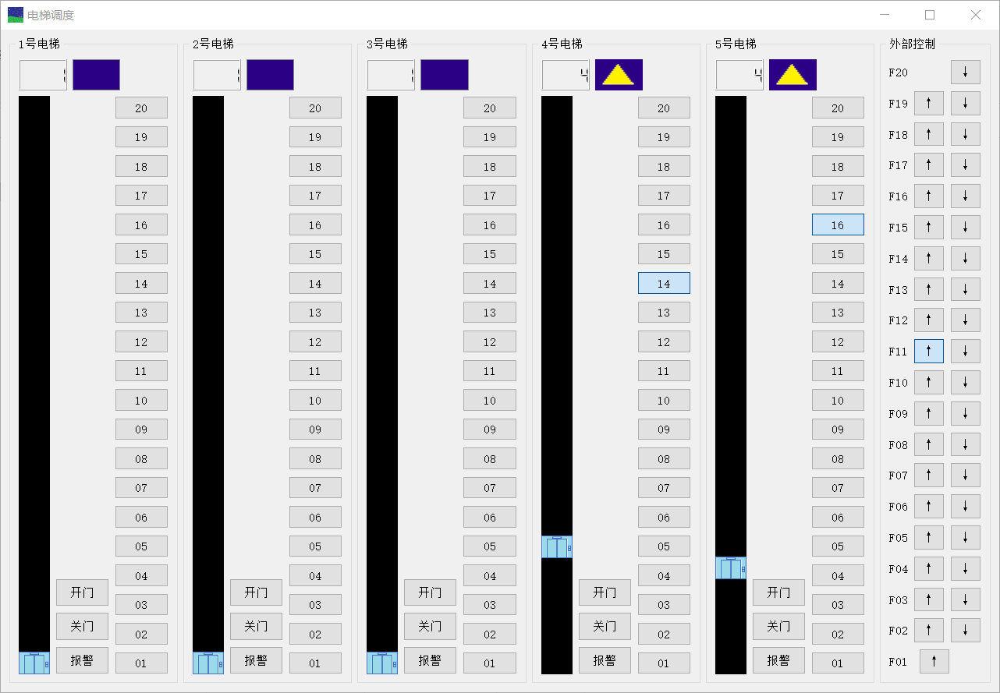
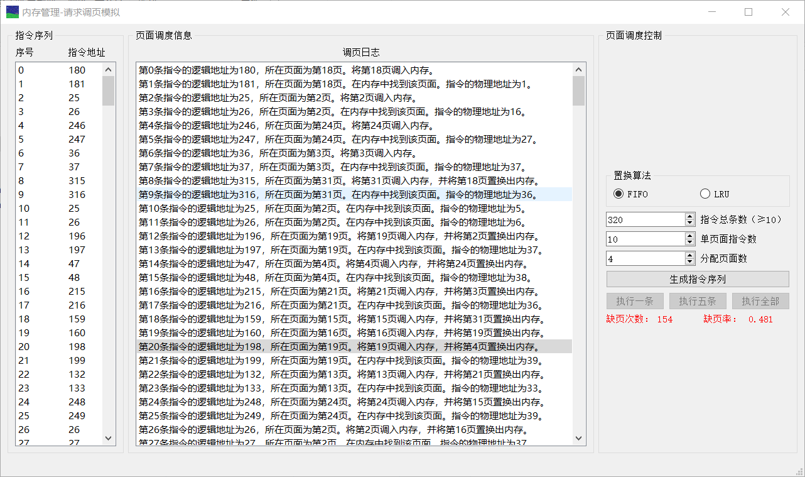
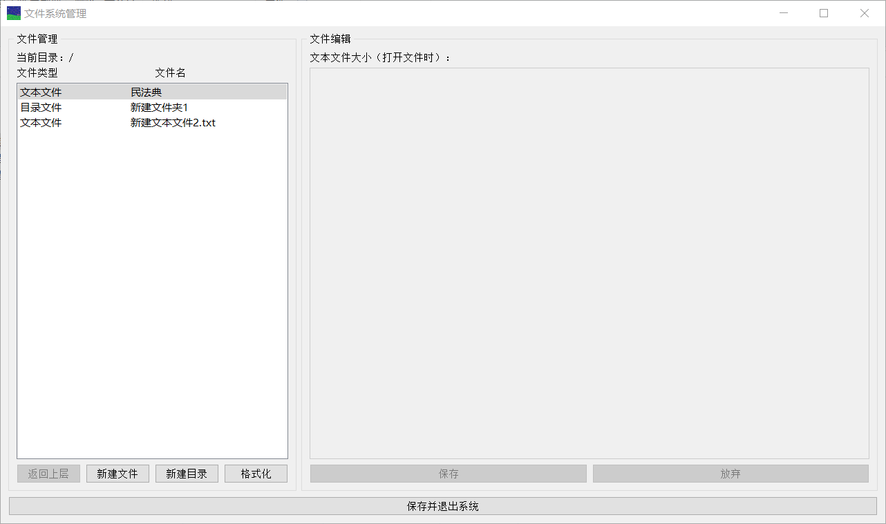

# OS_Course_Project

2019-2020 TJSSE Operating System Course Project

GPL v3 because of PyQt5, and codes unrelated to PyQt5 in this repository is under MIT.

## Project 1 Elevator

You may generate Elevator.py from Elevator.ui by entering "pyuic5 -o untitled.py untitled.ui" in your command line. And the actual Elevator.py is slightly modified.

You may enter "pyinstaller -F -w -i favicon.ico main.spec" to generate the .exe in the directory ./dist. PyQt5 or PySide2 (if you replace all PyQt5 with PySide2 in the .py's import manually) is required.

And the .exe should look like this:

## Project 2 Memory Management

The same as Project 1. And the .exe should look like this:

## Project 2 Memory Management

The same as Project 1. And the .exe should look like this:

